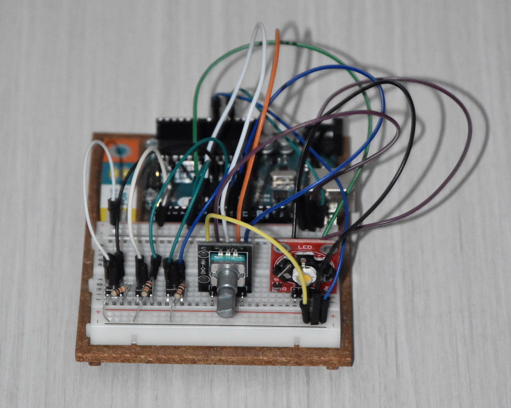
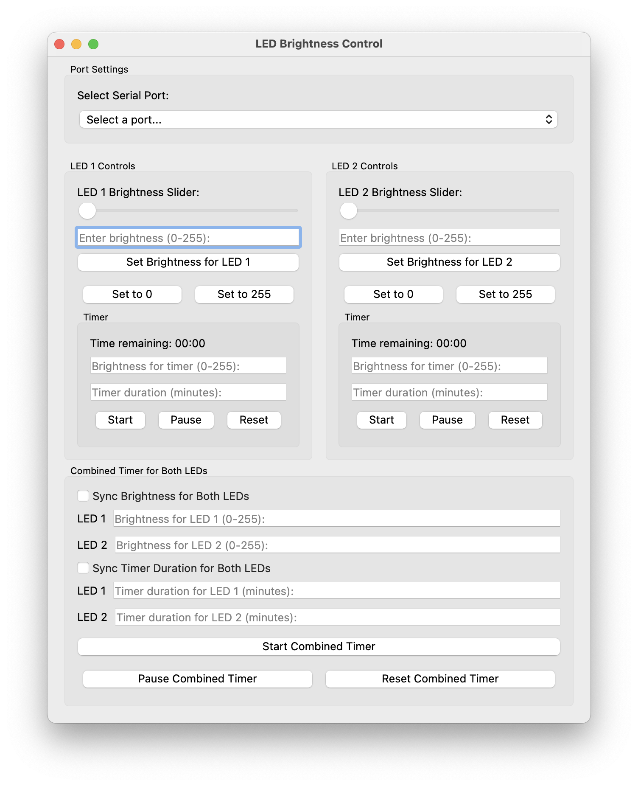

# blue-light-oroboros

## Úvod
V této práci se zabýváme vývojem externího světelného LED zdroje pro přístroj Oroboros O2k, který slouží pro vysoce přesné monitorování respirační aktivity biologických a biochemických vzorků.


*Stroj Oroboros O2k s nasazeným světlem*

## Problém
Stávající světelné zdroje pro Oroboros O2k jsou drahé (až kolem 1000 Eur) a u starších modelů již nedostupné. Naším cílem bylo navrhnout cenově dostupnou a modulární alternativu, která by umožnila precizní experimentální podmínky.

## Materiál a metody
Náš systém zahrnuje řídící box s elektronikou založenou na Arduino Leonardo. K ovládání světel je použit rotační enkodér a 3 tlačítka, zatímco desktopová aplikace umožňuje softwarové nastavení PWM signálu (0–255) pro dvě LED diody. LED zdroje s dominantní vlnovou délkou 465 nm jsou integrovány do 3D tištěných pouzder. Experiment proběhl s bilirubinem rozpuštěným v BSA, kdy fotooxidační reakce bilirubinu (na lumirubin a biliverdinové deriváty) vedly k měření spotřeby kyslíku.


*První verze zapojení na nepájivém poli*


*Finální zapojení na prototypové desce*

## Technický popis
Projekt využívá Arduino Leonardo pro řízení dvou LED diod, s PWM regulací a jednoduchým ovládáním pomocí enkodéru a tlačítek. Firmware na řídícím čipu přijímá sériové příkazy pro nastavení jasu jednotlivých LED. Uživatelská aplikace, vyvinutá v Pythonu s knihovnou PyQt5, umožňuje ovládání LED přes grafické rozhraní se samostatnými i synchronizovanými časovači, sliderem a textovým vstupem. Modularita hardwaru umožňuje rozšíření o další zdroje s různými vlnovými délkami.


*Finální box s možností připojení dvou LED světel*

## Výsledky
Vyvinutý systém umožňuje individuální i synchronizované ovládání obou LED světel, včetně časovačů pro přesné nastavení trvání osvětlení. Software poskytuje interaktivní slider, tlačítka předvoleb a možnost zadat konkrétní hodnoty jasu, což vede ke spolehlivému monitorování spotřeby kyslíku a k analýze fotoproduktů.

## Závěr a diskuse
Náš LED zdroj představuje praktickou a ekonomickou alternativu k původním řešením. Jeho modularita umožňuje rozšíření o další světelné zdroje s různými vlnovými délkami. Experiment s bilirubinem ukázal, že naše řešení umožňuje precizní kontrolu osvětlení, což výrazně ovlivňuje experimentální podmínky a kvalitu dat.

## Technická dokumentace

### Struktura projektu
```
blue-light-oroboros/
├── Software/
│   └── SW_Dual/
│       ├── led/
│       │   └── led.ino      # Arduino firmware pro ovládání LED
│       └── led2.py          # Python aplikace pro ovládání LED
├── Data/
│   ├── Graph1/
│   │   └── graph4.py        # Vizualizace dat - koncentrace BR
│   └── Graph2/
│       └── graph1.py        # Vizualizace dat - různé intenzity světla
└── Docs/
    └── Instrukce.pdf        # Instrukce pro sestavení
```

### Popis komponent

#### Arduino Firmware (led.ino)
- Ovládání dvou LED zdrojů přes PWM (piny 11 a 3)
- Implementace rotačního enkodéru pro manuální ovládání jasu
- Tři tlačítka pro rychlé předvolby (vypnuto, přepínání LED, maximum)
- Sériová komunikace pro příjem příkazů z PC aplikace

#### Python Aplikace (led2.py)
- GUI aplikace vytvořená v PyQt5
- Ovládání jasu LED pomocí slideru nebo přímého zadání hodnoty
- Implementace časovačů pro každou LED
- Možnost synchronizace obou LED
- Sériová komunikace s Arduino kontrolérem


*Uživatelské rozhraní aplikace pro ovládání LED světel*

#### Vizualizační skripty
- **graph1.py**: Analýza a vizualizace dat pro různé intenzity osvětlení
- **graph4.py**: Analýza a vizualizace dat pro různé koncentrace bilirubinu

### Hardware
- Arduino Leonardo
- 2x LED dioda (465 nm)
- Rotační enkodér
- 3x tlačítko
- 3D tištěná pouzdra pro LED a řídící box

### Komunikační protokol
- **Příkazy pro Arduino:**
  - `SET1:xxx` - Nastavení jasu LED 1 (xxx = 0-255)
  - `SET2:xxx` - Nastavení jasu LED 2 (xxx = 0-255)
- **Odpovědi z Arduina:**
  - `BRIGHTNESS1:xxx` - Aktuální jas LED 1
  - `BRIGHTNESS2:xxx` - Aktuální jas LED 2

## Literatura
- Oroboros Instruments: https://wiki.oroboros.at/index.php/PB_Light_Source
- Nature Article: https://www.nature.com/articles/s41598-020-61280-z
- Pediatrics: https://publications.aap.org/pediatrics/article/114/1/297/64771/Management-of-Hyperbilirubinemia-in-the-Newborn?autologincheck=redirected

## Poděkování
Děkujeme všem, kteří přispěli svými odbornými znalostmi a podporou k úspěšnému vývoji tohoto projektu.

